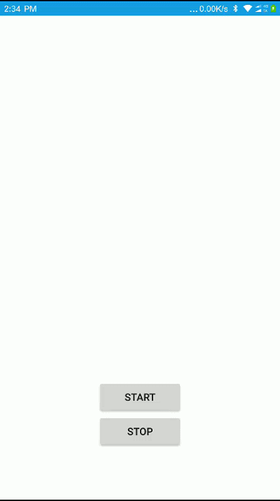

#LoadView

A loading view supports on API 15 and above.

##Samples
WeChat Mini Programs UI Demo:
<br><div></div>

##Usage

xml

````groovy
<org.looa.widget.LoadView
        android:id="@+id/load"
        android:layout_width="match_parent"
        android:layout_height="match_parent"
        android:layout_below="@id/tv_app_name"
        android:paddingTop="16dp"
        android:visibility="gone"
        app:count="3"
        app:distance="16dp"
        app:gravity="center_horizontal"
        app:normal_color="@color/colorLTGrey"
        app:radius="3dp"
        app:selected_color="@color/colorDKGrey" />
````

 Java
 ````groovy
 //show the loading view.
 loadView.show();
 ...
 //hide the loading view in 2000ms.
 loadView.hide();
 //hide the loading view in delayMillis.
 loadView.hide(long delayMillis);
 ````
